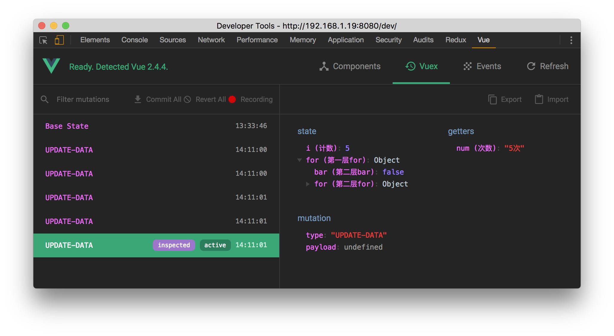

# vue-bus-devtools

> author: linjilei@qq.com

更好的在 vue-devtools 中调试 vue bus

当应用变得很大时, 我们可能会引用 `Vuex` 来进行状态整理, 在`vue-devtools`上可以很清楚的看到`vuex`的各项数据以及突变.

然而有些人会因为仅需将部分数据共享出来, 通过实例化一个 `vue`, 取得新的实例, 将数据交由该实例进行管理. 采用这种方式, 查看他们的数据会比较困难. 因此制作了这个工具来实现 通过`vue-devtool`来观察这种方式的数据, 同时也有`vue-devtool`带的时间旅游功能

## 安装
```
$ npm i vue-bus-devtool --save-dev
```

## 开始
```
import devtool from 'vue-bus-devtool'

const bus = new Vue({
  data () {
    return {
      text: 'World'
    }
  },
  computed: {
    msg () {
      return `Hello ${this.text}!`
    }
  }
})

const comments = {
  text: '文字',
  msg: '消息'
}

Vue.use(devtool, {
  // bus
  vm: bus,
  // 注释
  coments: comments
})
```

`devtool`插件通过 `Vue.use`的方式来使用. 传入`vm`和`注释`

注释将会自动附加在`vue-devtools`的`Vuex`面板中. 并且将传入的`vm`实例附加到`Vue`的原型下

## 效果图如下所示



可通过点击[该链接](https://xiaoyueguang.github.io/vue-bus-devtool/dev/index.html)按`F12`查看

<video controls="controls">
  <source src="//oe1lgo2hg.bkt.clouddn.com/vue-bus-devtool.mov"/>
</video>